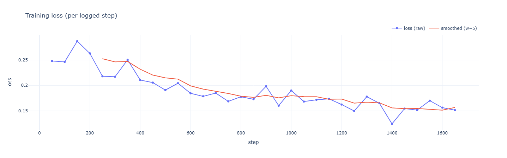

# PEFT Fine-tuning Recipes for Classification

A collection of Parameter Efficient Fine-Tuning (PEFT) recipes for text classification tasks using LoRA (Low-Rank Adaptation) and Llama models. This repository demonstrates how to fine-tune large language models efficiently for classification tasks using quantization and LoRA adapters.

## Features

- **Efficient Fine-tuning**: Uses LoRA (Low-Rank Adaptation) for parameter-efficient fine-tuning
- **8-bit Quantization**: Leverages BitsAndBytesConfig for memory-efficient training
- **Interactive Visualization**: Plotly-based training loss and evaluation metrics visualization
- **Multiple Interfaces**: Both Python scripts and Jupyter notebook workflows
- **Automated Setup**: UV-based dependency management and automation scripts

## Quick Start

### Prerequisites

- Python 3.9 or higher
- NVIDIA GPU with CUDA support (recommended)
- [UV package manager](https://github.com/astral-sh/uv) for dependency management

### Installation

1. **Clone the repository:**
   ```bash
   git clone https://github.com/jasonjiang8866/peft-fine-tuning-recipes-classification.git
   cd peft-fine-tuning-recipes-classification
   ```

2. **Install UV (if not already installed):**
   ```bash
   pip install uv
   ```

3. **Set up the environment:**
   ```bash
   uv run setup
   ```

   Or for training-only setup (no Jupyter dependencies):
   ```bash
   uv run setup-training
   ```

### Usage

#### Option 1: Using the Setup Script (Recommended)

**Full setup with Jupyter support:**
```bash
python setup.py setup
```

**Training-only setup (no Jupyter dependencies):**
```bash
python setup.py setup-train
```

**Setup with HuggingFace authentication:**
```bash
python setup.py setup-hf
```

**Run training:**
```bash
python setup.py train
```

**Start Jupyter Notebook:**
```bash
python setup.py notebook
```

**Start Jupyter Lab:**
```bash
python setup.py lab
```

**Generate visualizations:**
```bash
python setup.py visualize
```

**Clean up generated files:**
```bash
python setup.py clean
```

#### Option 2: Using UV Directly

**Install dependencies:**
```bash
uv pip install -e .        # Training only
uv pip install -e .[dev]   # With Jupyter support
```

**Run training:**
```bash
uv run python training.py
```

#### Option 2: Manual Setup

1. **Install dependencies:**
   ```bash
   pip install -e .
   ```

2. **Set up HuggingFace authentication:**
   ```bash
   python jupyter_setup.py
   ```

3. **Run training:**
   ```bash
   python training.py
   ```

4. **Or use the Jupyter notebook:**
   ```bash
   jupyter notebook finetuning.ipynb
   ```

## Training Results Visualization

The training process generates interactive HTML visualizations of the training progress:

### Training Loss Visualization



The training process automatically generates `train_loss.html` with an interactive Plotly chart showing:
- Training loss per step
- Smoothed loss curves for trend analysis
- Hover tooltips with detailed metrics

### Evaluation Metrics

The system also generates `eval_metrics.html` with comprehensive evaluation metrics including:
- Accuracy progression
- F1 score evolution
- Precision and recall metrics
- Runtime statistics

## Project Structure

```
├── pyproject.toml          # UV project configuration with dependencies
├── setup.py               # Automated setup script for all tasks
├── README.md              # This file
├── LICENSE                # MIT License
├── training.py            # Main training script
├── viz.py                 # Visualization utilities
├── jupyter_setup.py       # Environment setup for Jupyter
├── finetuning.ipynb      # Interactive Jupyter notebook
├── train_loss.html       # Generated training loss visualization
└── eval_metrics.html     # Generated evaluation metrics visualization
```

## Model Configuration

The default configuration uses:
- **Base Model**: `meta-llama/Llama-3.2-1B-Instruct`
- **Dataset**: AG News (4-class news categorization)
- **Quantization**: 8-bit with BitsAndBytesConfig
- **LoRA Configuration**:
  - Rank (r): 16
  - Alpha: 32
  - Dropout: 0.1
  - Target modules: All linear layers

## Customization

### Changing the Model

Edit `training.py` and modify the `MODEL` variable:
```python
MODEL = "meta-llama/Llama-3.2-1B-Instruct"  # Change to your preferred model
```

### Adjusting LoRA Parameters

Modify the LoRA configuration in `training.py`:
```python
lora = LoraConfig(
    r=16,                    # Increase for more parameters
    lora_alpha=32,           # Scaling factor
    lora_dropout=0.1,        # Dropout rate
    bias="none",
    task_type="SEQ_CLS",
    target_modules="all-linear"  # Target specific modules
)
```

### Using Different Datasets

Replace the dataset loading in `training.py`:
```python
ds = load_dataset("your_dataset_name")
```

## Hardware Requirements

**Minimum:**
- 8GB GPU memory (with 8-bit quantization)
- 16GB system RAM

**Recommended:**
- 16GB+ GPU memory
- 32GB+ system RAM
- NVIDIA RTX 3080/4080 or better

## Troubleshooting

### Common Issues

1. **CUDA Out of Memory**: Reduce batch size or enable gradient checkpointing
2. **HuggingFace Authentication**: Run `uv run setup-hf` to configure authentication
3. **Package Conflicts**: Use `uv run clean` to reset the environment

### Environment Variables

Set these environment variables for better control:
```bash
export HUGGINGFACE_HUB_TOKEN="your_token_here"  # For private models
export WANDB_DISABLED="true"                    # Disable Weights & Biases logging
export HF_HOME="/path/to/cache"                 # Custom HuggingFace cache directory
```

## Contributing

1. Fork the repository
2. Create a feature branch
3. Make your changes
4. Add tests if applicable
5. Submit a pull request

## License

This project is licensed under the MIT License - see the [LICENSE](LICENSE) file for details.

## Citation

If you use this code in your research, please consider citing:

```bibtex
@software{peft_classification_recipes,
  title={PEFT Fine-tuning Recipes for Classification},
  author={JYC},
  year={2025},
  url={https://github.com/jasonjiang8866/peft-fine-tuning-recipes-classification}
}
```

## Acknowledgments

- [Hugging Face](https://huggingface.co/) for the transformers and PEFT libraries
- [Microsoft](https://github.com/microsoft/LoRA) for the LoRA technique
- [Meta](https://ai.meta.com/llama/) for the Llama model series
- [Plotly](https://plotly.com/) for visualization capabilities